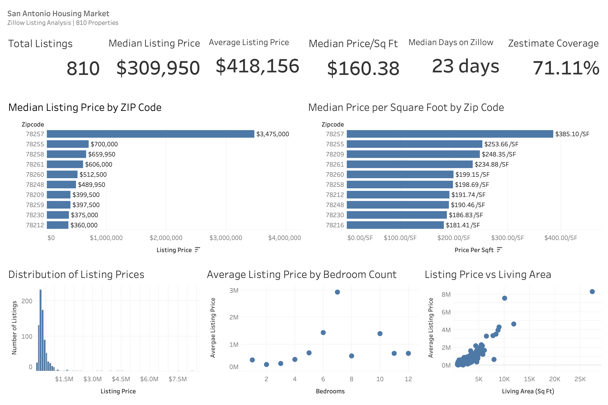
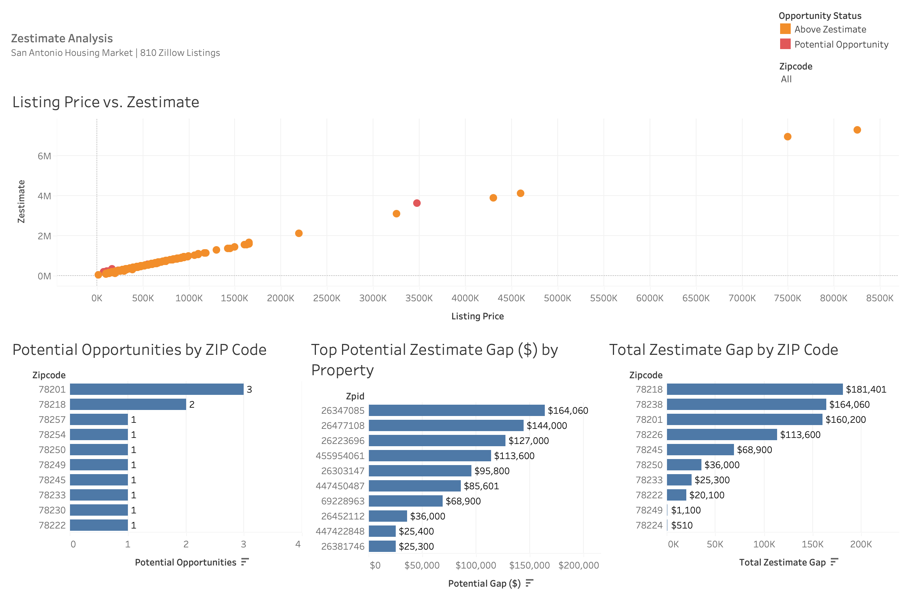
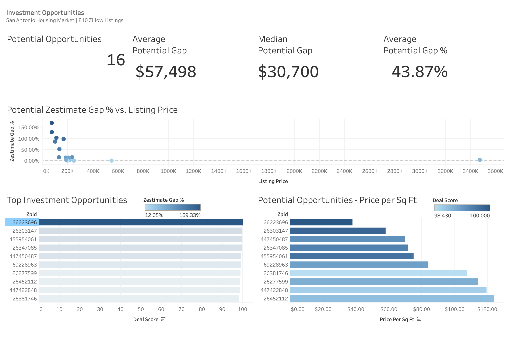

# San Antonio Zillow Housing Analysis

### End-to-End Data Analytics, Machine Learning & Business Intelligence Project

An end-to-end analysis of **810 Zillow housing listings in San Antonio, Texas**, combining Python, PostgreSQL/SQL, machine learning, and Tableau to analyze housing-market patterns, identify property-price relationships, evaluate Zestimate/listing-price differences, and develop a predictive housing-price model.

**Portfolio Focus:** Data Analytics • Data Science • SQL • PostgreSQL • Python • Machine Learning • Tableau • Real Estate Analytics

---

## Project Overview

This project was developed as a complete analytical workflow rather than as a single modeling exercise.

The analysis progresses from data collection and preparation through data-quality validation, exploratory analysis, statistical testing, SQL-based market analysis, predictive modeling, model interpretation, diagnostic analysis, Tableau visualization, and business recommendations.

The final analytical dataset contains:

- **810 property listings**
- **810 unique Zillow property IDs**
- **0 duplicate property IDs**
- **0 missing listing prices**
- **0 missing ZIP codes**
- **0 missing living-area values**
- **71.11% Zestimate coverage**

The project demonstrates how the same business problem can be approached across multiple analytical technologies and then integrated into a single portfolio workflow.

---

## Business Problem

Real-estate listing data contains information about property characteristics, geographic location, market exposure, listing prices, tax-assessed values, and Zillow valuation estimates.

The objective of this project was to determine:

1. What does the San Antonio housing market look like?
2. Which ZIP codes have the highest and lowest listing-price levels?
3. How does price per square foot vary geographically?
4. Which property characteristics are most strongly associated with listing price?
5. How closely do Zillow Zestimates align with observed listing prices?
6. Can listing prices be predicted without relying on Zestimate?
7. Where does the prediction model perform poorly?
8. Can properties with substantial positive Zestimate gaps be identified as potential pricing opportunities?
9. How can the findings be communicated to a business audience through interactive dashboards?

---

## Analytical Workflow

```text
Zillow Listing Data
        ↓
Data Collection
        ↓
Data Cleaning & Preparation
        ↓
Data Quality Validation
        ↓
Outlier Analysis
        ↓
Feature Engineering
        ↓
Exploratory Data Analysis
        ↓
Statistical Analysis
        ↓
PostgreSQL / SQL Analysis
        ↓
Python Visualization
        ↓
Machine Learning
        ↓
Model Evaluation & Diagnostics
        ↓
Model Interpretation
        ↓
Zestimate Opportunity Analysis
        ↓
Tableau Dashboards
        ↓
Business Insights & Recommendations
```

---

# Key Findings

## San Antonio Housing Market

Across the 810 listings:

| Metric | Result |
|---|---:|
| Total Listings | 810 |
| Median Listing Price | $309,950 |
| Average Listing Price | $418,156 |
| Median Living Area | 1,999.5 sq ft |
| Mean Living Area | 2,251 sq ft |
| Median Price/Sq Ft | $160.38 |
| Average Price/Sq Ft | $170.12 |
| Median Days on Zillow | 23 |
| Average Days on Zillow | 51.33 |
| Zestimate Coverage | 71.11% |

The difference between the mean and median listing price reflects the strong right-skew of the market caused by a relatively small number of high-value properties.

### Price Distribution

The largest concentration of listings falls within the middle of the market:

- **$150K–$300K:** 324 listings
- **$300K–$500K:** 265 listings

Together, these segments represent **72.72% of the dataset**.

---

# ZIP Code Analysis

ZIP-code analysis used a minimum sample-size threshold of **10 valid listings** for standalone rankings.

ZIP codes with fewer than 10 listings were retained for exploration but excluded from rankings where sample size could make comparisons unstable.

### Highest Median Listing Prices

| ZIP Code | Listings | Median Price | Median Price/Sq Ft |
|---|---:|---:|---:|
| 78257 | 11 | $3,475,000 | $385.10 |
| 78255 | 23 | $700,000 | $253.66 |
| 78258 | 38 | $659,950 | $198.69 |
| 78261 | 14 | $606,000 | $234.88 |
| 78260 | 22 | $512,500 | $199.15 |

ZIP 78257 had the highest median listing price and median price per square foot among sufficiently sampled ZIP codes.

Across sufficiently sampled ZIP codes:

- Median listing price and median living area had a strong positive association (**r = 0.9758**).
- Median listing price and median price per square foot were also strongly associated (**r = 0.8491**).

These relationships are descriptive and should not be interpreted as causal.

---

# Data Engineering & Feature Engineering

The project uses a structured Python workflow to transform raw Zillow-derived listing information into an analytical dataset.

Key preparation steps included:

- Data-type standardization
- Missing-value assessment
- Duplicate detection
- Price normalization
- ZIP-code standardization
- Property-type normalization
- Living-area validation
- Outlier investigation
- Feature creation
- Analytical validation

### Key Engineered Features

| Feature | Purpose |
|---|---|
| `zipcode` | Standardized geographic identifier |
| `lotAreaSqFt` | Standardized lot size |
| `pricePerSqFt` | Listing price relative to living area |
| `logPrice` | Log-transformed listing price for modeling |
| `hasPriceChange` | Indicates whether a listing has a recorded price change |
| `zestimate_gap` | Zestimate minus listing price |
| `zestimate_gap_pct` | Zestimate gap relative to listing price |
| `opportunity_status` | Classifies potential Zestimate-based pricing opportunities |
| `deal_score` | Relative ranking of positive Zestimate gap percentage |
| `price_segment` | Market price segmentation |
| `zip_listing_count` | ZIP-level sample size |
| `zip_sample_status` | Identifies sufficiently sampled versus sparse ZIP codes |

Outliers were investigated and documented rather than automatically removed.

---

# SQL & PostgreSQL Analysis

PostgreSQL was used to demonstrate a relational analytical workflow independent of the Python analysis layer.

### Database Architecture

```text
Zillow Source Data
        ↓
staging.zillow_analysis_raw
        ↓
analytics.zillow_listings
        ↓
Analytical Views
        ↓
Tableau
```

The SQL layer includes:

- Database and schema creation
- Staging-table preparation
- Analytical-table creation
- Data-quality checks
- Market KPIs
- Price segmentation
- ZIP-code analysis
- Zestimate analysis
- Property-level opportunity rankings
- ZIP/property-type composition
- Window-function rankings
- Tableau-ready analytical views
- Final validation

### SQL Techniques Demonstrated

- `GROUP BY`
- `HAVING`
- `CASE`
- Aggregate functions
- Conditional aggregation
- Common table expressions
- Window functions
- `ROW_NUMBER()`
- `RANK()`
- `PERCENT_RANK()`
- Percentile calculations
- Analytical views
- Validation queries

The final SQL validation reconciles the major analytical views back to the authoritative 810-property dataset.

The complete PostgreSQL workflow is available in the
[SQL directory](sql/).

The workflow progresses from database schema creation and staging through market analysis, ZIP analysis, Zestimate analysis, advanced rankings, analytical views, and final validation.

See the [SQL workflow documentation](sql/README.md).

---

# Exploratory Data Analysis

Exploratory analysis examined:

- Listing-price distributions
- Log-price distributions
- Living area
- Bedrooms
- Bathrooms
- Lot size
- Tax-assessed value
- Days on Zillow
- Price per square foot
- Correlations
- ZIP-level pricing
- Property-type distributions
- Zestimate relationships
- Potential pricing opportunities

The EDA workflow is available in the
[EDA notebook](notebooks/01_eda.ipynb).

The corresponding Python workflow is available in
[06_exploratory_data_analysis.py](python/06_exploratory_data_analysis.py).

---

# Statistical Analysis

Statistical analysis was used to move beyond descriptive charts and formally evaluate relationships and group differences.

The analysis included:

- Correlation analysis
- Correlation hypothesis testing
- Confidence intervals
- Effect sizes
- Group descriptive statistics
- Bedroom-group comparisons
- Property-type comparisons
- ZIP-group comparisons
- Zestimate paired comparisons
- ANOVA/Kruskal-Wallis analysis
- Regression analysis
- Multicollinearity assessment
- VIF analysis
- Regression diagnostics

Statistical relationships are interpreted as associations rather than causal effects.
The statistical analysis workflow is documented in
[07_statistical_analysis.py](python/07_statistical_analysis.py).

Supporting statistical outputs are available in
[reports/statistical_analysis](reports/statistical_analysis/).

---

# Machine Learning

## Objective

The machine-learning objective was to predict **listing price without relying on Zestimate or other target-derived variables**.

The target variable was:

```text
logPrice
```

### Predictors

The leakage-safe predictor set consisted of:

- `area`
- `beds`
- `baths`
- `lotAreaSqFt`
- `taxAssessedValue`
- `daysOnZillow`

The modeling dataset contained:

- **810 analytical records**
- **731 complete modeling cases**

Rows missing required modeling variables were excluded from the modeling dataset rather than having predictor values fabricated.

### Leakage Prevention

The following variables were excluded from the model because they are target-derived, directly related to listing price, or would introduce leakage:

- `price`
- `pricePerSqFt`
- `zestimate`
- `zestimate_gap`
- `zestimate_gap_pct`
- `deal_score`
- `opportunity_status`

This separation allows Zestimate opportunity analysis to remain a distinct business-analysis component rather than becoming a predictor of the target.

The complete machine learning workflow is available in
[09_machine_learning.py](python/09_machine_learning.py).

The model evaluation workflow is available in
[10_model_evaluation.py](python/10_model_evaluation.py).

An interactive version of the modeling workflow is available in the
[housing price modeling notebook](notebooks/02_housing_price_model.ipynb).

---

# Models Evaluated

The project compared multiple model families.

### Linear Models

- Linear Regression
- Ridge Regression
- Lasso Regression
- Elastic Net

### Tree-Based Models

- Random Forest
- Gradient Boosting
- Tuned Gradient Boosting

---

# Model Selection

A shuffled **10-fold cross-validation** procedure with `random_state=42` was used to compare model performance.

| Model | Mean CV R² |
|---|---:|
| Linear Regression | 0.3896 |
| Ridge | 0.3935 |
| Lasso | 0.3953 |
| Elastic Net | 0.3937 |
| Random Forest | 0.8128 |
| Gradient Boosting | 0.8151 |
| **Tuned Gradient Boosting** | **0.8286** |

### Selected Model

**Tuned Gradient Boosting**

Hyperparameters:

```text
n_estimators = 100
learning_rate = 0.05
max_depth = 3
min_samples_split = 5
min_samples_leaf = 1
subsample = 1.0
```

### Cross-Validated Performance

| Metric | Result |
|---|---:|
| Mean CV R² | 0.8286 |
| CV R² SD | 0.0783 |
| Mean CV RMSE | 0.2558 |
| Mean CV MAE | 0.1800 |

The cross-validation results are the primary basis for discussing expected model generalization.

---

# Model Evaluation

The final evaluation included log-scale and back-transformed dollar metrics, along with calibration and residual diagnostics.

For the 731 complete modeling cases:

| Metric | Result |
|---|---:|
| R² | 0.9068 |
| Log RMSE | 0.1924 |
| Log MAE | 0.1368 |
| Dollar RMSE | $107,724.53 |
| Dollar MAE | $52,141 |
| Median Absolute Error | $33,235 |
| MAPE | 14.45% |
| Median APE | 10.08% |

The 731-case evaluation results are evaluated on the complete modeling population; the cross-validated results above provide the more appropriate estimate of out-of-sample generalization.

---

# Model Interpretation

Multiple interpretation techniques were used to understand the selected model:

- Built-in feature importance
- Permutation importance
- Cross-validated permutation importance
- SHAP
- Partial dependence analysis
- Individual conditional expectation
- Local model explanations

### SHAP Results

| Feature | Mean Absolute SHAP Share |
|---|---:|
| Tax Assessed Value | 70.79% |
| Living Area | 16.76% |
| Lot Area | 7.84% |
| Days on Zillow | 2.92% |
| Beds | 1.06% |
| Baths | 0.63% |

Tax-assessed value was the dominant predictive signal in the selected model, followed by living area and lot area.

These importance measures describe predictive contribution within the fitted model and should not be interpreted as proof of causation.

---

# Model Error & Diagnostic Analysis

Model performance was not uniform across the price distribution.

### Observed Error Pattern

- Lower-priced properties were more likely to be overpredicted.
- Higher-priced properties were increasingly likely to be underpredicted.
- Properties above $2M were underpredicted in approximately 80% of cases.
- The highest prediction decile showed an average underprediction of approximately **$95,378**.

This indicates a tendency toward **regression to the mean**, where predictions become compressed toward the center of the observed price distribution.

### Calibration

The model demonstrated:

- Strong overall calibration
- Log calibration R² ≈ 0.9083
- Dollar calibration R² ≈ 0.9762

The most appropriate interpretation is:

> **Strong overall calibration with systematic compression at the price extremes.**

This suggests that additional features may be needed to better capture unusual or luxury-market properties.

---

# Zestimate Analysis

Zestimate analysis was treated as a separate business-analysis layer rather than as a machine-learning predictor.

### Zestimate Coverage

- Listings with Zestimate: **576**
- Listings without Zestimate: **234**
- Zestimate coverage: **71.11%**

Among the 576 listings with Zestimate data:

- Mean Zestimate gap: **-$11,800**
- Median Zestimate gap: **-$5,300**
- Mean gap percentage: **-0.99%**
- Median gap percentage: **-1.70%**

Only:

**16 of 576 listings (2.78%)**

had a Zestimate above their asking price.

---

# Potential Zestimate-Based Opportunities

For the 16 listings where:

```text
Zestimate > Listing Price
```

the analysis found:

| Metric | Result |
|---|---:|
| Potential Opportunities | 16 |
| Mean Potential Gap | $57,498 |
| Median Potential Gap | $30,700 |
| Mean Gap Percentage | 43.87% |
| Median Gap Percentage | 14.53% |
| Total Positive Gap | $919,971 |

All 16 potential opportunities were single-family properties in this sample.

These results represent **screening signals**, not confirmed investment opportunities.

The analysis does not model:

- Property condition
- Renovation requirements
- Transaction costs
- Financing
- Market liquidity
- Time to sale
- Local comparables
- Zestimate uncertainty
- Investment returns

Therefore, the combined positive gap of approximately $920K should **not** be interpreted as guaranteed profit or investment return.

---

# Geographic Opportunity Analysis

Potential Zestimate-based pricing opportunities were concentrated in a relatively small number of ZIP codes.

### Notable Findings

**ZIP 78201**

- 14 Zestimate-covered listings
- 3 potential opportunities
- 21.43% opportunity rate
- $25,400 median positive gap

**ZIP 78257**

- 10 Zestimate-covered listings
- 1 potential opportunity
- $144,000 median positive gap among identified opportunities
- 4.14% median gap percentage

**ZIP 78245**

- 38 Zestimate-covered listings
- 1 potential opportunity
- 50.66% median gap percentage among the identified opportunity

Several sufficiently sampled ZIP codes contained no listings priced below Zestimate, indicating that potential Zestimate-based pricing discrepancies were not uniformly distributed across the market.

---

# Tableau Dashboards

The project includes three completed Tableau dashboards connected to the PostgreSQL analytical layer.

## Dashboard 1 — San Antonio Housing Market

The market dashboard presents:

- Total Listings
- Median Listing Price
- Average Listing Price
- Median Price/Sq Ft
- Median Days on Zillow
- Zestimate Coverage
- Median Listing Price by ZIP
- Median Price/Sq Ft by ZIP
- Listing Price Distribution
- Average Listing Price by Bedroom Count
- Listing Price vs. Living Area



---

## Dashboard 2 — Zestimate Analysis

The Zestimate dashboard presents:

- Listing Price vs. Zestimate
- Potential Opportunities by ZIP
- Total Zestimate Gap by ZIP
- Top Zestimate Gap by Property
- Opportunity Status
- ZIP filtering
- Price filtering
- Bedroom and bathroom filtering



---

## Dashboard 3 — Potential Zestimate-Based Opportunities

The opportunity dashboard presents:

- Potential Opportunity Count
- Average Potential Gap
- Median Potential Gap
- Average Potential Gap %
- Deal Score ranking
- Zestimate Gap % vs. Listing Price
- Price/Sq Ft analysis



The completed Tableau workbook is available here:

[San Antonio Zillow Dashboard](tableau/San_Antonio_Zillow_Dashboard.twbx)

---

# Business Insights

The analysis produces several practical findings.

### 1. The San Antonio sample is concentrated in the middle of the market

Approximately **72.72% of listings fall between $150K and $500K**, making this the dominant portion of the observed market.

### 2. Geographic pricing differences are substantial

ZIP 78257 had a median listing price of **$3.475M**, substantially above the median prices observed in most other sufficiently sampled ZIP codes.

### 3. Property size is strongly associated with geographic price differences

Median ZIP-level listing price had a very strong positive association with median living area (**r = 0.9758**).

### 4. Zestimate discrepancies are relatively uncommon

Only **2.78% of Zestimate-covered listings** had asking prices below their Zestimate.

### 5. Potential opportunities are concentrated

The 16 potential opportunities were not evenly distributed geographically, with several ZIP codes containing no identified opportunities.

### 6. Tax-assessed value is the strongest model signal

Tax-assessed value contributed the largest share of model explanation under the SHAP analysis, followed by living area.

### 7. The model performs differently across the price distribution

The model generally performs better around the center of the market and becomes increasingly conservative at the extremes.

### 8. Model performance should be interpreted through cross-validation

The Tuned Gradient Boosting model achieved a **0.8286 mean cross-validated R²**, providing substantially stronger generalization performance than the linear baselines.

---

# Limitations

Several limitations should be considered when interpreting the findings.

### Dataset Limitations

The analysis represents a specific sample of San Antonio Zillow listings rather than a complete census of all housing transactions.

### Zestimate Coverage

Zestimate was unavailable for 234 listings, so Zestimate-based analyses apply only to properties with available Zestimate values.

### ZIP-Code Sample Size

ZIP codes with fewer than 10 valid listings were excluded from standalone rankings to reduce the risk of unstable comparisons.

### Missing Modeling Variables

The machine-learning dataset contains 731 complete modeling cases because rows missing required predictor variables were excluded.

### Model Limitations

The model does not include every factor that can influence housing prices, such as:

- School quality
- Crime
- Renovation quality
- Interior condition
- Neighborhood amenities
- Property age
- Detailed location effects
- Interest rates
- Mortgage conditions
- Local economic conditions

### Extreme-Value Performance

The model shows systematic compression at the upper and lower price extremes, indicating that additional features could improve predictions for unusual properties.

### Zestimate Interpretation

A positive Zestimate gap is a potential screening signal rather than proof that a property is undervalued or profitable.

---

# Technologies Used

### Programming & Data Analysis

- Python
- Pandas
- NumPy
- SciPy
- Scikit-learn
- SHAP
- Matplotlib

### Database & SQL

- PostgreSQL
- SQL
- CTEs
- Window Functions
- Analytical Views

### Business Intelligence

- Tableau

### Development & Portfolio

- Jupyter Notebook
- Git
- GitHub

---

## Repository Structure

```text
san-antonio-zillow-housing-analysis/
│
├── README.md
├── requirements.txt
├── .gitignore
│
├── data/
│   ├── README.md
│   ├── raw/
│   │   ├── README.md
│   │   └── San_Antonio_Zillow_Raw.csv
│   │
│   └── processed/
│       ├── README.md
│       ├── San_Antonio_Zillow_Processed.csv
│       ├── San_Antonio_Zillow_Analysis.csv
│       └── San_Antonio_Zillow_Feature_Engineered.csv
│
├── python/
│   ├── README.md
│   ├── 01_data_collection.py
│   ├── 02_data_cleaning.py
│   ├── 03_data_quality_analysis.py
│   ├── 04_outlier_analysis.py
│   ├── 05_feature_engineering.py
│   ├── 06_exploratory_data_analysis.py
│   ├── 07_statistical_analysis.py
│   ├── 08_visualization.py
│   ├── 09_machine_learning.py
│   └── 10_model_evaluation.py
│
├── sql/
│   ├── README.md
│   ├── 01_create_database_schema.sql
│   ├── 02_create_staging_table.sql
│   ├── 03_create_analytics_table.sql
│   ├── 04_data_quality_checks.sql
│   ├── 05_market_analysis.sql
│   ├── 06_zip_analysis.sql
│   ├── 07_zestimate_analysis.sql
│   ├── 08_advanced_rankings.sql
│   ├── 09_create_analytical_views.sql
│   └── 10_final_validation.sql
│
├── notebooks/
│   ├── README.md
│   ├── 01_eda.ipynb
│   └── 02_housing_price_model.ipynb
│
├── tableau/
│   ├── README.md
│   └── San_Antonio_Zillow_Dashboard.twbx
│
├── reports/
│   ├── README.md
│   ├── data_quality/
│   ├── exploratory_data_analysis/
│   ├── feature_engineering/
│   ├── machine_learning/
│   ├── model_evaluation/
│   ├── outliers/
│   ├── statistical_analysis/
│   └── visualization/
│
└── images/
    ├── dashboard_1_market.png
    ├── dashboard_2_zestimate.png
    └── dashboard_3_opportunities.png
```

# Reproducibility

The project is organized so that the analytical workflow can be reproduced from the repository.

### Python Workflow

The Python scripts are numbered according to the analytical sequence:

```text
01 Data Collection
02 Data Cleaning
03 Data Quality
04 Outlier Analysis
05 Feature Engineering
06 Exploratory Data Analysis
07 Statistical Analysis
08 Visualization
09 Machine Learning
10 Model Evaluation
```
The complete Python workflow is available in the
[Python directory](python/).

The pipeline progresses from data collection and cleaning through data quality analysis, outlier 
analysis, feature engineering, EDA, statistical analysis, visualization, machine learning, and 
model evaluation.

### SQL Workflow

The PostgreSQL workflow follows:

```text
01 Database / Schema Setup
02 Staging Table
03 Analytical Table
04 Data Quality Checks
05 Market Analysis
06 ZIP Analysis
07 Zestimate Analysis
08 Advanced Rankings
09 Analytical Views
10 Final Validation
```

### Notebooks

The notebooks provide a more interactive presentation of the completed analysis:

```text
01_eda.ipynb
02_housing_price_model.ipynb
```

### Tableau

The Tableau workbook connects the visualization layer to the PostgreSQL analytical architecture.

---

# Project Deliverables

The repository contains:

- Clean analytical datasets
- Feature-engineered dataset
- Python analytical scripts
- Statistical analysis outputs
- PostgreSQL analytical scripts
- Machine-learning model outputs
- Model evaluation and diagnostic outputs
- Tableau dashboards
- Interactive Jupyter notebooks
- Supporting reports and visualizations

---

# Future Improvements

Potential extensions include:

- Incorporating additional neighborhood-level variables
- Adding school and demographic information
- Adding property-age and renovation features
- Incorporating geospatial distance features
- Testing additional gradient-boosting algorithms
- Hyperparameter optimization
- Time-series market analysis
- External comparable-sales data
- More robust modeling of luxury properties
- Deployment of the predictive model as an interactive application

---

# Conclusion

This project demonstrates an end-to-end approach to real-estate analytics that combines **data engineering, statistical analysis, SQL, machine learning, model interpretation, and business intelligence**.

The analysis shows substantial geographic variation in San Antonio listing prices, a market concentrated in the $150K–$500K range, limited but identifiable Zestimate-based pricing discrepancies, and strong predictive value from property characteristics such as tax-assessed value and living area.

The final Tuned Gradient Boosting model achieved a **0.8286 mean cross-validated R²**, while diagnostic analysis revealed systematic compression at the extremes of the price distribution.

The project ultimately demonstrates how raw housing data can be transformed into:

```text
Data
  ↓
Information
  ↓
Statistical Evidence
  ↓
Predictive Modeling
  ↓
Business Intelligence
  ↓
Actionable Insights
```

---

## Author

**Nuur Abdallah**

Data Analytics • Data Science • Accounting & Financial Analytics

---


